# TayAI System Architecture Diagram

## High-Level System Architecture

```mermaid
graph TB
    subgraph "Client Layer"
        User[👤 User]
        Browser[🌐 Web Browser]
    end

    subgraph "Frontend Layer"
        NextJS[⚛️ Next.js Frontend<br/>Port: 3000]
        ChatWidget[💬 ChatWidget Component]
        AuthContext[🔐 AuthContext]
        APIClient[📡 API Client<br/>axios]
    end

    subgraph "Backend Layer - FastAPI"
        FastAPI[🚀 FastAPI Backend<br/>Port: 8000]
        
        subgraph "API Endpoints"
            AuthEP[🔑 /api/v1/auth]
            ChatEP[💬 /api/v1/chat]
            UsageEP[📊 /api/v1/usage]
            AdminEP[👨‍💼 /api/v1/admin]
        end
        
        subgraph "Middleware"
            CORS[CORS Middleware]
            TrustedHost[Trusted Host]
            AuthDeps[Authentication Dependencies]
        end
        
        subgraph "Service Layer"
            ChatService[ChatService]
            RAGService[RAGService]
            UserService[UserService]
            UsageService[UsageService]
            KnowledgeService[KnowledgeService]
        end
        
        subgraph "Core Components"
            Security[Security Utils<br/>JWT, Bcrypt]
            Config[Configuration<br/>Settings]
        end
    end

    subgraph "Data Layer"
        PostgreSQL[(🗄️ PostgreSQL<br/>Port: 5432)]
        Redis[(⚡ Redis<br/>Port: 6379)]
    end

    subgraph "External Services"
        OpenAI[🤖 OpenAI API<br/>GPT-4, Embeddings]
        Pinecone[🔍 Pinecone<br/>Vector Database]
    end

    User --> Browser
    Browser --> NextJS
    NextJS --> ChatWidget
    NextJS --> AuthContext
    ChatWidget --> APIClient
    AuthContext --> APIClient
    
    APIClient --> FastAPI
    FastAPI --> CORS
    CORS --> TrustedHost
    TrustedHost --> AuthEP
    TrustedHost --> ChatEP
    TrustedHost --> UsageEP
    TrustedHost --> AdminEP
    
    AuthEP --> AuthDeps
    ChatEP --> AuthDeps
    UsageEP --> AuthDeps
    AdminEP --> AuthDeps
    
    AuthDeps --> Security
    AuthDeps --> UserService
    
    ChatEP --> ChatService
    ChatService --> RAGService
    ChatService --> UsageService
    ChatService --> PostgreSQL
    
    RAGService --> OpenAI
    RAGService --> Pinecone
    
    UsageService --> PostgreSQL
    UserService --> PostgreSQL
    KnowledgeService --> PostgreSQL
    KnowledgeService --> RAGService
    
    AdminEP --> KnowledgeService
    
    Config --> FastAPI
    Security --> Config
    
    style User fill:#e1f5ff
    style NextJS fill:#61dafb
    style FastAPI fill:#009688
    style PostgreSQL fill:#336791
    style Redis fill:#dc382d
    style OpenAI fill:#412991
    style Pinecone fill:#5cceee
```



## Detailed Component Architecture

### Backend Service Layer


        
## Data Flow Diagram


## Database Schema


## Technology Stack

### Frontend
- **Framework**: Next.js (React)
- **Language**: TypeScript
- **HTTP Client**: Axios
- **State Management**: React Context (AuthContext)
- **Styling**: Tailwind CSS

### Backend
- **Framework**: FastAPI (Python)
- **Language**: Python 3.11+
- **ORM**: SQLAlchemy (Async)
- **Authentication**: JWT (OAuth2)
- **Password Hashing**: Bcrypt

### Database & Storage
- **Primary DB**: PostgreSQL 14+
- **Cache**: Redis 7+
- **Vector DB**: Pinecone

### External Services
- **AI Model**: OpenAI GPT-4
- **Embeddings**: OpenAI text-embedding-3-small
- **Vector Search**: Pinecone

### Infrastructure
- **Containerization**: Docker & Docker Compose
- **API Documentation**: FastAPI Auto-generated (Swagger/OpenAPI)

## API Endpoints Structure

```mermaid
graph TD
    API[FastAPI App] --> Router[API Router /api/v1]
    
    Router --> Auth[/auth]
    Router --> Chat[/chat]
    Router --> Usage[/usage]
    Router --> Admin[/admin]
    
    Auth --> Login[POST /login]
    Auth --> Verify[POST /verify]
    
    Chat --> SendMessage[POST /]
    Chat --> History[GET /history]
    
    Usage --> Status[GET /]
    
    Admin --> Knowledge[GET/POST /knowledge]
    Admin --> KnowledgeItem[GET/PUT/DELETE /knowledge/:id]
```

## Security Architecture


## Deployment Architecture


## Key Architectural Patterns

1. **Layered Architecture**: Clear separation between API, Service, and Data layers
2. **Dependency Injection**: FastAPI's dependency system for authentication and database sessions
3. **RAG (Retrieval-Augmented Generation)**: Combines vector search with LLM for context-aware responses
4. **JWT Authentication**: Stateless authentication with token-based access control
5. **Async/Await**: Full async support for I/O operations (database, API calls)
6. **Service-Oriented**: Business logic encapsulated in service classes
7. **Repository Pattern**: Database access abstracted through SQLAlchemy models

## Data Flow Summary

1. **User Authentication**: User credentials → JWT token generation → Token stored in localStorage
2. **Chat Request**: User message → Usage validation → RAG context retrieval → OpenAI API call → Response storage
3. **Knowledge Base Management**: Admin uploads content → Embedding generation → Pinecone indexing → Metadata storage
4. **Usage Tracking**: Every chat request → Token usage recorded → Monthly limits enforced

