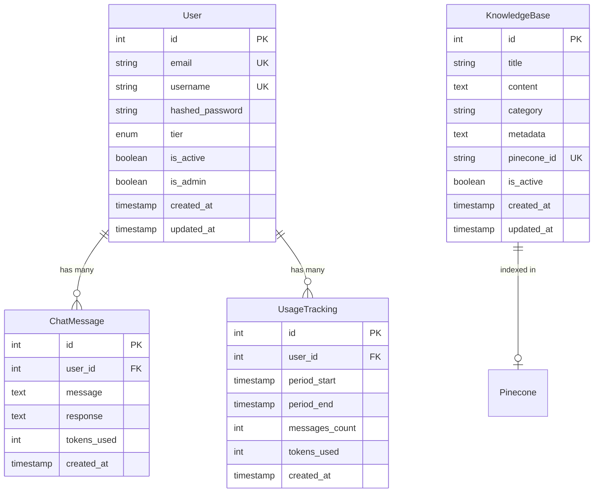

# TayAI Database Schema Design

## Overview

The TayAI project uses **PostgreSQL** as its primary database with **SQLAlchemy ORM** for database operations. The schema is designed to support user authentication, chat message storage, usage tracking, and knowledge base management.

## Entity-Relationship Diagram (ERD)



## Database Tables

### 1. `users` Table

Stores user account information, authentication credentials, and membership tier.

| Column | Type | Constraints | Description |
|--------|------|-------------|-------------|
| `id` | INTEGER | PRIMARY KEY, AUTO INCREMENT, INDEXED | Unique user identifier |
| `email` | VARCHAR | UNIQUE, NOT NULL, INDEXED | User email address (unique) |
| `username` | VARCHAR | UNIQUE, NOT NULL, INDEXED | Username (unique) |
| `hashed_password` | VARCHAR | NOT NULL | Bcrypt hashed password |
| `tier` | ENUM | NOT NULL, DEFAULT 'basic' | Membership tier: `basic`, `premium`, `vip` |
| `is_active` | BOOLEAN | NOT NULL, DEFAULT TRUE | Account active status |
| `is_admin` | BOOLEAN | NOT NULL, DEFAULT FALSE | Admin privileges flag |
| `created_at` | TIMESTAMP WITH TIME ZONE | NOT NULL, DEFAULT NOW() | Account creation timestamp |
| `updated_at` | TIMESTAMP WITH TIME ZONE | NULLABLE, ON UPDATE NOW() | Last update timestamp |

**Indexes:**
- Primary Key: `id`
- Unique Index: `email`
- Unique Index: `username`
- Index: `email` (for fast lookups)
- Index: `username` (for fast lookups)

**Relationships:**
- One-to-Many with `chat_messages` (via `user_id`)
- One-to-Many with `usage_tracking` (via `user_id`)

**Sample Data:**
```sql
INSERT INTO users (email, username, hashed_password, tier, is_active, is_admin)
VALUES 
  ('user@example.com', 'johndoe', '$2b$12$...', 'premium', true, false),
  ('admin@example.com', 'admin', '$2b$12$...', 'vip', true, true);
```

---

### 2. `chat_messages` Table

Stores all chat conversations between users and the AI assistant.

| Column | Type | Constraints | Description |
|--------|------|-------------|-------------|
| `id` | INTEGER | PRIMARY KEY, AUTO INCREMENT, INDEXED | Unique message identifier |
| `user_id` | INTEGER | NOT NULL, INDEXED | Foreign key to `users.id` |
| `message` | TEXT | NOT NULL | User's message content |
| `response` | TEXT | NULLABLE | AI assistant's response |
| `tokens_used` | INTEGER | NOT NULL, DEFAULT 0 | Number of tokens consumed for this message |
| `created_at` | TIMESTAMP WITH TIME ZONE | NOT NULL, DEFAULT NOW() | Message creation timestamp |

**Indexes:**
- Primary Key: `id`
- Index: `user_id` (for fast user message queries)
- Composite Index (recommended): `(user_id, created_at)` for chat history queries

**Relationships:**
- Many-to-One with `users` (via `user_id`)

**Sample Data:**
```sql
INSERT INTO chat_messages (user_id, message, response, tokens_used)
VALUES 
  (1, 'How do I style curly hair?', 'For curly hair, start with...', 245),
  (1, 'What products do you recommend?', 'I recommend using...', 312);
```

**Query Patterns:**
- Get user's chat history: `SELECT * FROM chat_messages WHERE user_id = ? ORDER BY created_at DESC LIMIT 50`
- Count messages per user: `SELECT user_id, COUNT(*) FROM chat_messages GROUP BY user_id`

---

### 3. `usage_tracking` Table

Tracks monthly usage statistics for each user (messages sent and tokens consumed).

| Column | Type | Constraints | Description |
|--------|------|-------------|-------------|
| `id` | INTEGER | PRIMARY KEY, AUTO INCREMENT, INDEXED | Unique tracking record identifier |
| `user_id` | INTEGER | NOT NULL, INDEXED | Foreign key to `users.id` |
| `period_start` | TIMESTAMP WITH TIME ZONE | NOT NULL | Start of billing/usage period (first day of month) |
| `period_end` | TIMESTAMP WITH TIME ZONE | NOT NULL | End of billing/usage period (last day of month) |
| `messages_count` | INTEGER | NOT NULL, DEFAULT 0 | Number of messages sent in this period |
| `tokens_used` | INTEGER | NOT NULL, DEFAULT 0 | Total tokens consumed in this period |
| `created_at` | TIMESTAMP WITH TIME ZONE | NOT NULL, DEFAULT NOW() | Record creation timestamp |

**Indexes:**
- Primary Key: `id`
- Index: `user_id` (for fast user usage queries)
- Composite Index (recommended): `(user_id, period_start)` for monthly usage lookups

**Relationships:**
- Many-to-One with `users` (via `user_id`)

**Business Logic:**
- One record per user per month
- Period is calculated as: first day of month 00:00:00 to last day of month 23:59:59
- Records are created/updated when users send messages
- Used for enforcing tier-based usage limits

**Sample Data:**
```sql
INSERT INTO usage_tracking (user_id, period_start, period_end, messages_count, tokens_used)
VALUES 
  (1, '2024-01-01 00:00:00+00', '2024-01-31 23:59:59+00', 15, 4500),
  (1, '2024-02-01 00:00:00+00', '2024-02-29 23:59:59+00', 8, 2100);
```

**Query Patterns:**
- Get current month usage: `SELECT * FROM usage_tracking WHERE user_id = ? AND period_start >= ? AND period_end <= ?`
- Check if user can send message: Compare `messages_count` with tier limit

---

### 4. `knowledge_base` Table

Stores knowledge base content that is indexed in Pinecone for RAG (Retrieval-Augmented Generation).

| Column | Type | Constraints | Description |
|--------|------|-------------|-------------|
| `id` | INTEGER | PRIMARY KEY, AUTO INCREMENT, INDEXED | Unique knowledge base entry identifier |
| `title` | VARCHAR | NOT NULL | Title of the knowledge entry |
| `content` | TEXT | NOT NULL | Full content text (used for embedding) |
| `category` | VARCHAR | NULLABLE | Category/topic classification |
| `metadata` | TEXT | NULLABLE | JSON string with additional metadata |
| `pinecone_id` | VARCHAR | UNIQUE, NULLABLE | Pinecone vector ID (unique identifier in Pinecone) |
| `is_active` | BOOLEAN | NOT NULL, DEFAULT TRUE | Whether this entry is active and searchable |
| `created_at` | TIMESTAMP WITH TIME ZONE | NOT NULL, DEFAULT NOW() | Entry creation timestamp |
| `updated_at` | TIMESTAMP WITH TIME ZONE | NULLABLE, ON UPDATE NOW() | Last update timestamp |

**Indexes:**
- Primary Key: `id`
- Unique Index: `pinecone_id` (ensures one-to-one mapping with Pinecone)
- Index: `category` (for filtering by category)
- Index: `is_active` (for filtering active entries)

**Relationships:**
- External: One-to-One with Pinecone vector (via `pinecone_id`)

**Sample Data:**
```sql
INSERT INTO knowledge_base (title, content, category, pinecone_id, is_active)
VALUES 
  ('Hair Styling Tips', 'For curly hair, use a diffuser...', 'hair_education', 'kb_001', true),
  ('Business Growth Strategies', 'To grow your business...', 'business_mentorship', 'kb_002', true);
```

**Query Patterns:**
- Get active entries: `SELECT * FROM knowledge_base WHERE is_active = true`
- Get by category: `SELECT * FROM knowledge_base WHERE category = ? AND is_active = true`
- Find by Pinecone ID: `SELECT * FROM knowledge_base WHERE pinecone_id = ?`

---

## Enumerations

### `UserTier` Enum

Defines membership tiers with different usage limits.

| Value | Description | Monthly Message Limit |
|-------|-------------|----------------------|
| `basic` | Basic membership tier | 50 messages/month |
| `premium` | Premium membership tier | 200 messages/month |
| `vip` | VIP membership tier | 1000 messages/month |

**Implementation:**
```python
class UserTier(str, enum.Enum):
    BASIC = "basic"
    PREMIUM = "premium"
    VIP = "vip"
```

---

## Relationships Summary

### One-to-Many Relationships

1. **User → ChatMessage**
   - One user can have many chat messages
   - Foreign key: `chat_messages.user_id` → `users.id`
   - Cascade: On user deletion, decide if messages should be deleted or anonymized

2. **User → UsageTracking**
   - One user can have many usage tracking records (one per month)
   - Foreign key: `usage_tracking.user_id` → `users.id`
   - Cascade: Typically keep historical usage data

### External Relationships

3. **KnowledgeBase → Pinecone**
   - One knowledge base entry maps to one Pinecone vector
   - Link: `knowledge_base.pinecone_id` stores the Pinecone vector ID
   - This is a logical relationship, not a database foreign key

---

## Indexes Strategy

### Primary Indexes
- All tables have `id` as PRIMARY KEY (auto-indexed)

### Unique Indexes
- `users.email` - Ensures email uniqueness
- `users.username` - Ensures username uniqueness
- `knowledge_base.pinecone_id` - Ensures one-to-one mapping with Pinecone

### Performance Indexes
- `users.email` - Fast email lookups for authentication
- `users.username` - Fast username lookups for authentication
- `chat_messages.user_id` - Fast retrieval of user's chat history
- `usage_tracking.user_id` - Fast retrieval of user's usage data
- `knowledge_base.category` - Fast filtering by category
- `knowledge_base.is_active` - Fast filtering of active entries

### Recommended Composite Indexes
```sql
-- For efficient chat history queries
CREATE INDEX idx_chat_messages_user_created 
ON chat_messages(user_id, created_at DESC);

-- For efficient monthly usage lookups
CREATE INDEX idx_usage_tracking_user_period 
ON usage_tracking(user_id, period_start);
```

---

## Data Types and Constraints

### String Types
- **VARCHAR**: Used for emails, usernames, titles, categories (variable length)
- **TEXT**: Used for messages, responses, content, metadata (unlimited length)

### Integer Types
- **INTEGER**: Used for IDs, counts, tokens (32-bit signed integer)

### Boolean Types
- **BOOLEAN**: Used for flags (is_active, is_admin)

### DateTime Types
- **TIMESTAMP WITH TIME ZONE**: All timestamps include timezone information
- Default values use `func.now()` for server-side timestamp generation

### Enum Types
- **ENUM**: UserTier enum stored as PostgreSQL ENUM type

---

## Database Design Principles

### 1. **Normalization**
- Tables are normalized to 3NF (Third Normal Form)
- No redundant data storage
- Foreign key relationships maintain referential integrity

### 2. **Timezone Awareness**
- All timestamps use `TIMESTAMP WITH TIME ZONE`
- Ensures consistent time handling across different timezones
- Server defaults use `func.now()` for UTC timestamps

### 3. **Soft Deletes**
- `is_active` flags allow soft deletion without data loss
- Historical data preserved in `usage_tracking` and `chat_messages`

### 4. **Scalability Considerations**
- Indexes on frequently queried columns
- Composite indexes for common query patterns
- Separation of concerns (chat messages vs usage tracking)

### 5. **Audit Trail**
- `created_at` and `updated_at` timestamps on all relevant tables
- Tracks when records are created and modified

---

## SQL Schema (PostgreSQL)

```sql
-- Create UserTier enum type
CREATE TYPE user_tier AS ENUM ('basic', 'premium', 'vip');

-- Users table
CREATE TABLE users (
    id SERIAL PRIMARY KEY,
    email VARCHAR NOT NULL UNIQUE,
    username VARCHAR NOT NULL UNIQUE,
    hashed_password VARCHAR NOT NULL,
    tier user_tier NOT NULL DEFAULT 'basic',
    is_active BOOLEAN NOT NULL DEFAULT TRUE,
    is_admin BOOLEAN NOT NULL DEFAULT FALSE,
    created_at TIMESTAMP WITH TIME ZONE NOT NULL DEFAULT NOW(),
    updated_at TIMESTAMP WITH TIME ZONE
);

-- Create indexes for users
CREATE INDEX idx_users_email ON users(email);
CREATE INDEX idx_users_username ON users(username);

-- Chat messages table
CREATE TABLE chat_messages (
    id SERIAL PRIMARY KEY,
    user_id INTEGER NOT NULL,
    message TEXT NOT NULL,
    response TEXT,
    tokens_used INTEGER NOT NULL DEFAULT 0,
    created_at TIMESTAMP WITH TIME ZONE NOT NULL DEFAULT NOW()
);

-- Create indexes for chat_messages
CREATE INDEX idx_chat_messages_user_id ON chat_messages(user_id);
CREATE INDEX idx_chat_messages_user_created ON chat_messages(user_id, created_at DESC);

-- Usage tracking table
CREATE TABLE usage_tracking (
    id SERIAL PRIMARY KEY,
    user_id INTEGER NOT NULL,
    period_start TIMESTAMP WITH TIME ZONE NOT NULL,
    period_end TIMESTAMP WITH TIME ZONE NOT NULL,
    messages_count INTEGER NOT NULL DEFAULT 0,
    tokens_used INTEGER NOT NULL DEFAULT 0,
    created_at TIMESTAMP WITH TIME ZONE NOT NULL DEFAULT NOW()
);

-- Create indexes for usage_tracking
CREATE INDEX idx_usage_tracking_user_id ON usage_tracking(user_id);
CREATE INDEX idx_usage_tracking_user_period ON usage_tracking(user_id, period_start);

-- Knowledge base table
CREATE TABLE knowledge_base (
    id SERIAL PRIMARY KEY,
    title VARCHAR NOT NULL,
    content TEXT NOT NULL,
    category VARCHAR,
    metadata TEXT,
    pinecone_id VARCHAR UNIQUE,
    is_active BOOLEAN NOT NULL DEFAULT TRUE,
    created_at TIMESTAMP WITH TIME ZONE NOT NULL DEFAULT NOW(),
    updated_at TIMESTAMP WITH TIME ZONE
);

-- Create indexes for knowledge_base
CREATE INDEX idx_knowledge_base_category ON knowledge_base(category);
CREATE INDEX idx_knowledge_base_is_active ON knowledge_base(is_active);
CREATE INDEX idx_knowledge_base_pinecone_id ON knowledge_base(pinecone_id);

-- Add foreign key constraints (if using explicit foreign keys)
-- Note: Current implementation uses implicit relationships
-- ALTER TABLE chat_messages ADD CONSTRAINT fk_chat_messages_user 
--     FOREIGN KEY (user_id) REFERENCES users(id) ON DELETE CASCADE;
-- 
-- ALTER TABLE usage_tracking ADD CONSTRAINT fk_usage_tracking_user 
--     FOREIGN KEY (user_id) REFERENCES users(id) ON DELETE RESTRICT;
```

---

## Usage Patterns and Query Examples

### Authentication Queries
```sql
-- Find user by email
SELECT * FROM users WHERE email = 'user@example.com';

-- Find user by username
SELECT * FROM users WHERE username = 'johndoe';

-- Verify user credentials
SELECT id, hashed_password, is_active FROM users WHERE email = 'user@example.com';
```

### Chat History Queries
```sql
-- Get user's recent chat history
SELECT * FROM chat_messages 
WHERE user_id = 1 
ORDER BY created_at DESC 
LIMIT 50;

-- Get total messages per user
SELECT user_id, COUNT(*) as message_count 
FROM chat_messages 
GROUP BY user_id;
```

### Usage Tracking Queries
```sql
-- Get current month usage for a user
SELECT * FROM usage_tracking 
WHERE user_id = 1 
  AND period_start >= '2024-01-01 00:00:00+00'
  AND period_end <= '2024-01-31 23:59:59+00';

-- Check if user can send message (compare with tier limit)
SELECT messages_count, 
       CASE 
         WHEN messages_count < 50 THEN TRUE 
         ELSE FALSE 
       END as can_send
FROM usage_tracking 
WHERE user_id = 1 
  AND period_start >= DATE_TRUNC('month', NOW());
```

### Knowledge Base Queries
```sql
-- Get all active knowledge base entries
SELECT * FROM knowledge_base WHERE is_active = TRUE;

-- Get entries by category
SELECT * FROM knowledge_base 
WHERE category = 'hair_education' AND is_active = TRUE;

-- Find entry by Pinecone ID
SELECT * FROM knowledge_base WHERE pinecone_id = 'kb_001';
```

---

## Data Integrity Considerations

### Current Implementation
- **Implicit Foreign Keys**: The current SQLAlchemy models use `user_id` as INTEGER without explicit ForeignKey constraints
- **Application-Level Validation**: Foreign key relationships are enforced at the application level through SQLAlchemy queries

### Recommended Enhancements
1. **Add Explicit Foreign Keys**: For database-level referential integrity
2. **Cascade Rules**: Define behavior on user deletion (CASCADE, RESTRICT, SET NULL)
3. **Check Constraints**: Add validation for positive integers (tokens_used, messages_count)
4. **Unique Constraints**: Ensure one usage_tracking record per user per month

---

## Migration Strategy

The project uses **Alembic** for database migrations (configured in `alembic.ini`). 

**Current State**: Tables are created automatically via SQLAlchemy's `Base.metadata.create_all()` in `init_db()` function.

**Recommended**: Use Alembic migrations for production:
```bash
# Create initial migration
alembic revision --autogenerate -m "Initial schema"

# Apply migrations
alembic upgrade head
```

---

## Performance Optimization

### Caching Strategy
- **Redis Cache**: Usage tracking queries are cached in Redis
- Cache key format: `usage:{user_id}:{YYYY-MM}`
- Cache TTL: 1 hour (3600 seconds)

### Query Optimization
- Use indexes for frequently queried columns
- Composite indexes for multi-column queries
- Limit results with `LIMIT` clause for pagination
- Use `SELECT` specific columns instead of `SELECT *` when possible

### Partitioning Considerations (Future)
- `chat_messages` table could be partitioned by `created_at` for large-scale deployments
- `usage_tracking` could be partitioned by `period_start` for historical data management

---

## Security Considerations

1. **Password Storage**: Passwords are hashed using Bcrypt (not stored in plain text)
2. **SQL Injection**: SQLAlchemy ORM prevents SQL injection through parameterized queries
3. **Data Access**: Application-level authorization checks user permissions
4. **Sensitive Data**: No sensitive data stored in `chat_messages` or `knowledge_base` tables

---

## Backup and Recovery

### Recommended Backup Strategy
1. **Daily Full Backups**: PostgreSQL pg_dump for complete database
2. **Transaction Logs**: Enable WAL (Write-Ahead Logging) for point-in-time recovery
3. **Knowledge Base**: Backup both PostgreSQL metadata and Pinecone vectors

### Recovery Procedures
- Restore from latest backup
- Re-index knowledge base entries in Pinecone if needed
- Verify data integrity after restoration

