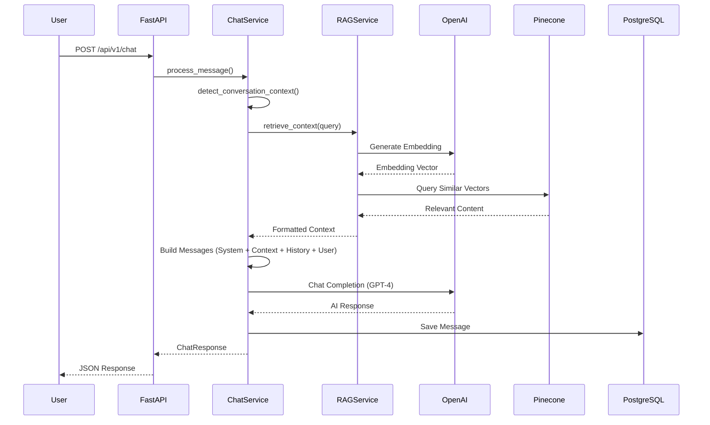

# Week 2: Core AI Build Documentation

## Overview

This document details the Week 2 implementation of TayAI's core AI functionality:

- **OpenAI GPT-4** integration with custom prompt engineering
- **Pinecone** vector database for semantic search
- **RAG pipeline** for context-enhanced responses
- **API endpoints** for chat and knowledge management
- **Persona system** for brand-aligned responses

## Architecture



## Key Components

### 1. Prompt Engineering System (`app/core/prompts/`)

The prompt engineering system is organized as a package with modular components:

#### Persona Configuration
```python
@dataclass
class PersonaConfig:
    name: str = "TayAI"
    brand_name: str = "TaysLuxe"
    identity: str = "the AI assistant for TaysLuxe..."
    expertise_areas: Dict[str, str]  # Hair education, business mentorship, etc.
    communication_style: Dict[str, str]  # Tone, approach, clarity, empathy
    response_guidelines: List[str]
    avoid: List[str]
```

#### Context Detection
Automatically detects the type of conversation:
- `HAIR_EDUCATION` - Hair care, styling, maintenance
- `BUSINESS_MENTORSHIP` - Business strategy, entrepreneurship
- `PRODUCT_RECOMMENDATION` - Product suggestions
- `TROUBLESHOOTING` - Problem solving
- `GENERAL` - Mixed topics

#### Dynamic System Prompts
Generates context-aware system prompts that adapt based on:
- Conversation type
- Available knowledge base context
- Brand voice and guidelines

### 2. RAG Service (`app/services/rag_service.py`)

#### Content Chunking
Large content is automatically chunked for optimal embedding:
```python
@dataclass
class ChunkConfig:
    chunk_size: int = 500      # Target characters per chunk
    chunk_overlap: int = 50    # Overlap between chunks
    min_chunk_size: int = 100  # Minimum chunk size
```

#### Relevance Scoring
Results are filtered by relevance score:
```python
async def retrieve_context(
    query: str,
    top_k: int = 5,
    score_threshold: float = 0.7,  # Minimum relevance
    include_sources: bool = False
)
```

#### Embedding Generation
Uses OpenAI's `text-embedding-3-small` model:
```python
async def _generate_embedding(self, text: str) -> List[float]:
    response = await openai_client.embeddings.create(
        model="text-embedding-3-small",
        input=text
    )
    return response.data[0].embedding
```

### 3. Chat Service (`app/services/chat_service.py`)

#### Message Processing Flow
1. Detect conversation context from user message
2. Retrieve relevant knowledge base content via RAG
3. Build conversation messages with persona + context + history
4. Call OpenAI GPT-4 for response
5. Save conversation to database
6. Return response with optional source info

#### Conversation Context Management
```python
MAX_CONVERSATION_HISTORY = 10  # Messages to include
TEMPERATURE = 0.7              # Response creativity
MAX_TOKENS = 1000              # Max response length
```

### 4. Knowledge Base Management

#### Creating Knowledge Items
```python
# Content is automatically:
# 1. Saved to PostgreSQL
# 2. Chunked based on size
# 3. Embedded using OpenAI
# 4. Indexed in Pinecone

await knowledge_service.create_knowledge_item(
    KnowledgeBaseCreate(
        title="Understanding Hair Porosity",
        content="Hair porosity refers to...",
        category="hair_education"
    )
)
```

#### Bulk Upload
```python
result = await knowledge_service.bulk_create([
    KnowledgeBaseCreate(title="Topic 1", content="..."),
    KnowledgeBaseCreate(title="Topic 2", content="..."),
])
# Returns: success_count, error_count, errors
```

## API Endpoints

### Chat Endpoints (`/api/v1/chat`)

| Method | Endpoint | Description |
|--------|----------|-------------|
| POST | `/` | Send message, get AI response |
| GET | `/history` | Get user's chat history |
| GET | `/context` | Get recent conversation for context |
| DELETE | `/history` | Clear user's chat history |

### Admin Endpoints (`/api/v1/admin`)

| Method | Endpoint | Description |
|--------|----------|-------------|
| POST | `/knowledge` | Create knowledge item |
| GET | `/knowledge` | List knowledge items |
| GET | `/knowledge/{id}` | Get single item |
| PUT | `/knowledge/{id}` | Update item |
| DELETE | `/knowledge/{id}` | Delete item |
| POST | `/knowledge/bulk` | Bulk upload items |
| POST | `/knowledge/search` | Semantic search |
| GET | `/knowledge/stats` | Get statistics |
| POST | `/knowledge/reindex` | Reindex all in Pinecone |
| POST | `/persona/test` | Test persona response |
| GET | `/persona/context-types` | List context types |

## Setup Instructions

### 1. Environment Variables

Add to your `.env` file:
```bash
# OpenAI
OPENAI_API_KEY=sk-your-key-here
OPENAI_MODEL=gpt-4
OPENAI_EMBEDDING_MODEL=text-embedding-3-small

# Pinecone
PINECONE_API_KEY=your-pinecone-key
PINECONE_INDEX_NAME=tayai-knowledge-base
```

### 2. Initialize Pinecone Index

```bash
cd backend
python scripts/init_pinecone.py --create
```

Options:
- `--create` - Create new index
- `--status` - Check index status
- `--delete` - Delete index
- `--reset` - Delete and recreate

### 3. Seed Knowledge Base

```bash
python scripts/seed_knowledge_base.py
```

Options:
- `--dry-run` - Preview without saving
- `--category hair` - Seed specific category

### 4. Test the System

```bash
# Start the server
uvicorn app.main:app --reload

# Test persona endpoint (as admin)
curl -X POST http://localhost:8000/api/v1/admin/persona/test \
  -H "Authorization: Bearer $TOKEN" \
  -H "Content-Type: application/json" \
  -d '{"message": "How do I start a hair business?"}'
```

## Knowledge Base Categories

The initial seed data includes:

| Category | Description | Items |
|----------|-------------|-------|
| `hair_education` | Natural hair care fundamentals | 5 |
| `hair_styling` | Styling techniques and tutorials | 2 |
| `business_mentorship` | Business strategy and growth | 5 |
| `product_knowledge` | Product ingredients and recommendations | 2 |
| `brand_info` | About TaysLuxe | 1 |

## Persona Testing

### Using the Test Endpoint

```python
# Test different contexts
response = await chat_service.test_persona_response(
    test_message="How do I moisturize low porosity hair?",
    context_type=ConversationContext.HAIR_EDUCATION
)

# Response includes:
# - AI response text
# - Token usage
# - Detected context type
# - Sources from knowledge base
# - System prompt preview
```

### Response Quality Checklist

- [ ] Response matches TaysLuxe brand voice
- [ ] Information is accurate to knowledge base
- [ ] Tone is warm and encouraging
- [ ] Advice is specific and actionable
- [ ] Context from knowledge base is used naturally
- [ ] No explicit mentions of "knowledge base" or "context"

## Troubleshooting

### Common Issues

1. **Empty context retrieval**
   - Check Pinecone index exists: `python scripts/init_pinecone.py --status`
   - Verify knowledge base has content
   - Adjust `score_threshold` if being too strict

2. **Slow responses**
   - GPT-4 can take 2-5 seconds
   - Consider reducing `MAX_TOKENS`
   - Check network connectivity to OpenAI

3. **Pinecone errors**
   - Verify API key is correct
   - Check index dimension matches (1536 for text-embedding-3-small)
   - Ensure index is ready (not still initializing)

## Next Steps (Week 3+)

- [ ] Implement streaming responses
- [ ] Add conversation summarization for long chats
- [ ] Implement Redis caching for frequent queries
- [ ] Add response quality monitoring
- [ ] Build A/B testing for prompts
- [ ] Add multi-turn conversation optimization

## Project Structure

```
backend/app/
├── core/
│   ├── __init__.py          # Core module exports
│   ├── clients.py           # Shared OpenAI/Pinecone clients
│   ├── config.py            # Application settings (.env loading)
│   ├── security.py          # Auth utilities
│   └── prompts/             # Prompt engineering package
│       ├── __init__.py      # Package exports
│       ├── persona.py       # PersonaConfig, DEFAULT_PERSONA
│       ├── context.py       # ConversationContext, detection
│       ├── generation.py    # System prompt builders
│       └── fallbacks.py     # Fallback responses
├── services/
│   ├── __init__.py          # Service exports
│   ├── chat_service.py      # Chat processing with RAG
│   ├── rag_service.py       # Vector search & embeddings
│   ├── knowledge_service.py # Knowledge base management
│   ├── usage_service.py     # Usage tracking
│   └── user_service.py      # User management
├── api/v1/endpoints/
│   ├── admin.py             # Admin & persona testing
│   ├── auth.py              # Authentication
│   ├── chat.py              # Chat endpoints
│   └── usage.py             # Usage tracking
├── schemas/
│   ├── __init__.py          # Schema exports
│   ├── chat.py              # Chat request/response models
│   ├── knowledge.py         # Knowledge base models
│   └── auth.py              # Authentication models
├── utils/
│   ├── __init__.py          # Utility exports
│   └── text.py              # Text utilities (truncate, sanitize)
└── db/
    ├── database.py          # Database connection
    └── models.py            # SQLAlchemy models

backend/scripts/
├── init_pinecone.py         # Pinecone index management
├── seed_knowledge_base.py   # Initial content seeding
└── import_content.py        # Custom content import

backend/tests/
├── conftest.py              # Shared test fixtures
├── unit/                    # Unit tests
│   ├── test_prompts.py
│   ├── test_context.py
│   ├── test_utils.py
│   ├── test_schemas.py
│   └── test_rag_service.py
└── integration/             # Integration tests
    └── test_api.py
```

## Key Design Decisions

### 1. Centralized Clients (`core/clients.py`)
- Single source of truth for OpenAI and Pinecone clients
- Lazy initialization for efficient resource usage
- Easy to mock for testing

### 2. Modular Prompts (`core/prompts/`)
- **persona.py**: WHO TayAI is (identity, expertise, style)
- **context.py**: WHAT type of help is needed (detection logic)
- **generation.py**: HOW prompts are built (templates)
- **fallbacks.py**: Graceful error responses
- Benefits: Single responsibility, easier testing, clearer organization

### 3. Clean Service Layer
- Each service has single responsibility
- Services use shared clients (DRY principle)
- Consistent error handling and logging

### 4. Comprehensive Testing
- Unit tests for all core modules
- Integration tests for API endpoints
- Mocked external services (OpenAI, Pinecone)
- 117 automated tests with pytest
